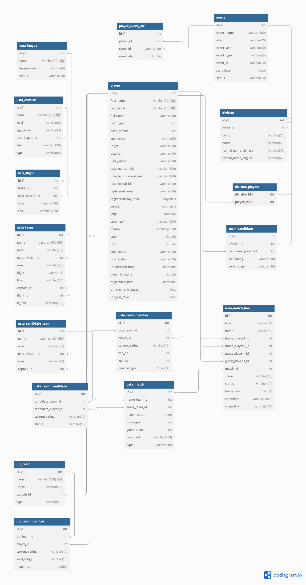

# 🎾 MatchApp

A comprehensive backend REST API application for analyzing **UTR** (Universal Tennis Rating) and **USTA** (United States Tennis Association) tennis data, built with **Spring Boot** and **MySQL** (hosted on DigitalOcean).  
Designed to provide powerful endpoints for match analysis, player statistics, team insights, lineup optimization, and tournament management.

---

## 📖 Description

**MatchApp** serves as the backbone for tennis data analysis, focusing on:

- **Data Integration**: Seamlessly integrates with UTR and USTA platforms to fetch and process player ratings, match results, and team information.
- **Advanced Analytics**: Provides sophisticated analysis tools for comparing players, teams, and predicting match outcomes.
- **Team Management**: Offers comprehensive team management features including roster management, lineup optimization, and performance tracking.
- **Tournament Support**: Specialized functionality for tournament organizers, including the ZiJing Cup and other events.
- **Excel Export**: Generates detailed Excel reports for teams, matches, and analysis results.

The application serves various user personas:
- **Team Captains**: Make data-driven decisions for team formation and lineup strategies.
- **Players**: Track personal performance metrics and compare with other players.
- **Tournament Directors**: Manage events, divisions, and team registrations efficiently.
- **Tennis Analysts**: Access comprehensive data for in-depth tennis performance analysis.

Built with:
- **Spring Boot**: For scalable, high-performance API services with robust dependency injection.
- **MySQL**: (hosted on DigitalOcean) for efficient relational data management with complex tennis relationships.
- **JPA/Hibernate**: For sophisticated object-relational mapping with the database.
- **RESTful Architecture**: Clean API design following REST principles for consistent client interactions.
- **Excel Integration**: For generating downloadable reports and analysis documents.

---

## 🏗️ Architecture

The application follows a clean, layered architecture with clear separation of concerns, making it maintainable, testable, and scalable.


### Key Components:

#### 🔹 Controller Layer
- **REST Controllers**: Expose endpoints for clients to interact with the application.
  - [USTA Controller](USTA_API_SPEC.md): Manages USTA-related data and operations.
  - [UTR Controller](UTR_API_SPEC.md): Handles UTR-specific functionality.
  - [Player Controller](PLAYER_API_SPEC.md): Provides player-centric operations.
  - [ZiJing Controller](ZIJING_API_SPEC.md): Specialized for ZiJing Cup tournament management.
- **Request Validation**: Ensures data integrity before processing.
- **Response Formatting**: Consistent response structures for clients.

#### 🔹 Service Layer
- **Business Logic**: Contains core application logic and rules.
- **Data Processing**: Transforms and processes tennis data.
- **Integration Services**: Communicates with external systems like UTR and USTA websites.
- **Analysis Engines**: Implements algorithms for player and team analysis.

#### 🔹 Repository Layer
- **Data Access Objects**: Interfaces with the database for CRUD operations.
- **Custom Queries**: Specialized database queries for complex data retrieval.
- **Transaction Management**: Ensures data consistency across operations.

#### 🔹 Model Layer
- **Domain Objects**: Represents core business entities like players, teams, matches.
- **Data Transfer Objects**: Facilitates data exchange between layers.
- **Value Objects**: Encapsulates complex values and calculations.

#### 🔹 Utility Components
- **Excel Exporters**: Generates Excel files for various data views.
- **Data Parsers**: Processes and transforms data from external sources.
- **Strategy Pattern Implementations**: Flexible algorithms for lineup optimization.

---

## 🗄️ Database Design

A well-structured relational database schema supports efficient querying and scalability, with carefully designed relationships between tennis entities.



### Schema Highlights:

- **Player Management**:
  - Comprehensive player profiles with UTR and USTA ratings.
  - Historical rating tracking for performance analysis.
  - Player relationships across multiple teams and events.

- **Team Structure**:
  - Teams with associated members and their roles.
  - Team hierarchies within divisions and leagues.
  - Historical team performance data.

- **Match Recording**:
  - Detailed match records with scores and outcomes.
  - Line-by-line breakdown of match play.
  - Statistical aggregation capabilities.

- **Tournament Organization**:
  - Event and division management.
  - Flight and bracket structuring.
  - Scheduling and results tracking.

- **Performance Analysis**:
  - Data structures optimized for analytical queries.
  - Historical trending capabilities.
  - Comparative analysis support.

---

## 📚 API Documentation

The application provides comprehensive RESTful APIs for accessing and manipulating tennis data. Detailed documentation for each controller is available:

- [**USTA API**](USTA_API_SPEC.md): Endpoints for USTA leagues, divisions, teams, players, and matches.
- [**UTR API**](UTR_API_SPEC.md): Endpoints for UTR events, ratings, teams, and player data.
- [**Player API**](PLAYER_API_SPEC.md): Player-centric endpoints for searching, retrieving, and updating player information.
- [**ZiJing API**](ZIJING_API_SPEC.md): Specialized endpoints for tournament management and lineup optimization.

Each API documentation includes:
- Endpoint URLs and HTTP methods
- Request parameters and body schemas
- Response formats and status codes
- Detailed purpose descriptions
- Data models and relationships

---

## 🔐 Security Features

The application implements several security best practices:

- **API Authentication**: Secure token-based authentication for API access.
- **Environment-Specific Configuration**: 
  - **Development**: Uses application.properties with direct values for local development
  - **Production**: Uses application-production.properties with environment variables
- **Secure Credential Management**: 
  - **UTR API Token**: Securely managed through environment variables in production
  - **Database Credentials**: Externalized through environment variables in production
  - **Google Sheets API**: Secure handling of Google API credentials
- **CORS Configuration**: Controlled cross-origin resource sharing for frontend integration
- **Docker Security**: Non-root user execution in containerized deployments

### Credential Management Best Practices

The application follows these security best practices for managing credentials:

1. **Development Environment**: 
   - Uses application.properties with direct values for ease of local development
   - No need to set environment variables for local testing

2. **Production Environment**: 
   - Uses application-production.properties which requires environment variables:
   ```bash
   # UTR API Token
   export UTR_API_TOKEN=your_actual_token_here
   
   # Database Credentials
   export SPRING_DATASOURCE_URL=jdbc:mysql://your-db-host:3306/matchapp
   export SPRING_DATASOURCE_USERNAME=your_username
   export SPRING_DATASOURCE_PASSWORD=your_password
   
   # Google API Credentials
   export GOOGLE_SPREADSHEET_ID=your_spreadsheet_id
   export GOOGLE_CREDENTIALS_FILE_PATH=/path/to/credentials.json
   ```

3. **Activating Production Profile**:
   - When deploying to production, activate the production profile:
   ```bash
   java -jar matchapp.jar --spring.profiles.active=production
   ```
   - Or set the environment variable:
   ```bash
   export SPRING_PROFILES_ACTIVE=production
   ```

4. **Secrets Management**: For production deployments, consider using a dedicated secrets management solution:
   - Kubernetes Secrets
   - AWS Secrets Manager
   - HashiCorp Vault
   - Docker Secrets

5. **Token Rotation**: Implement regular rotation of API tokens and credentials

---

## 🚀 Getting Started

### Prerequisites

- Java 17+
- Maven 3.6+
- MySQL 8.0+ database (hosted on DigitalOcean or local)
- UTR API token (for UTR data access)

### Installation & Running

1. **Clone the repository:**
   ```bash
   git clone https://github.com/austinxyz/MatchApp.git
   cd MatchApp
   ```

2. **Configure the database connection:**
   - Update `application.properties` with your MySQL credentials:
     ```properties
     spring.datasource.url=jdbc:mysql://your-db-host:3306/matchapp
     spring.datasource.username=your-username
     spring.datasource.password=your-password
     ```

3. **Configure the environment:**

   **For Local Development:**
   - No additional configuration needed - application.properties contains development values
   - You can modify application.properties for your local environment if needed

   **For Production Deployment:**
   - Activate the production profile:
     ```bash
     java -jar matchapp.jar --spring.profiles.active=production
     ```
     
   - Set required environment variables:
     ```bash
     # UTR API Token
     export UTR_API_TOKEN=your_actual_token_here
     
     # Database Credentials
     export SPRING_DATASOURCE_URL=jdbc:mysql://your-db-host:3306/matchapp
     export SPRING_DATASOURCE_USERNAME=your_username
     export SPRING_DATASOURCE_PASSWORD=your_password
     
     # Google Sheets API (if using)
     export GOOGLE_SPREADSHEET_ID=your_spreadsheet_id
     export GOOGLE_CREDENTIALS_FILE_PATH=/path/to/credentials.json
     ```

4. **Build and run the application:**
    ```bash
    mvn clean install
    mvn spring-boot:run
    ```

5. **Access the application:**
   - API base URL: http://localhost:8080
   - API documentation: See the [API Documentation](#-api-documentation) section

### API Testing

You can test the APIs using tools like:
- Postman
- cURL
- Swagger UI (if enabled)

Example API request:
```bash
curl -X GET http://localhost:8080/usta/open/leagues
```

---

## 🧪 Testing

The application includes comprehensive test coverage:

- Unit tests for service and utility classes
- Integration tests for repository and controller layers
- End-to-end tests for critical workflows

Run tests with:
```bash
mvn test
```

---

## 🤝 Contributing

Contributions are welcome! Please feel free to submit a Pull Request.

1. Fork the repository
2. Create your feature branch (`git checkout -b feature/amazing-feature`)
3. Commit your changes (`git commit -m 'Add some amazing feature'`)
4. Push to the branch (`git push origin feature/amazing-feature`)
5. Open a Pull Request

---

## 📄 License

This project is licensed under the MIT License - see the LICENSE file for details.
